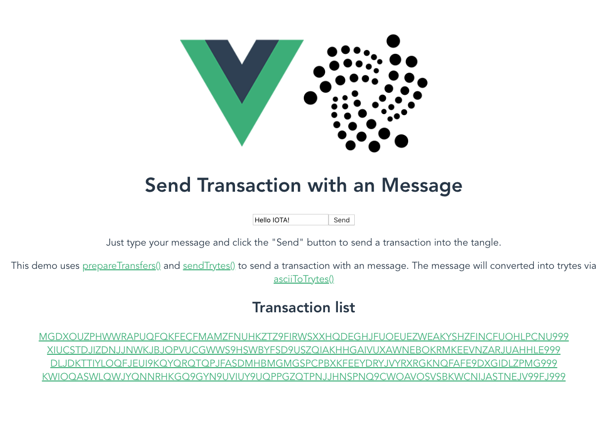

# 02_send_hello


Send an transaction with an message into the tangle and view the result!

## Project setup
```
npm install
```

### Compiles and hot-reloads for development
```
npm run serve
```

### Open your browser and visit the page
[Visit Page](http://localhost:8080/).


Example:




## More Options

### Compiles and minifies for production
```
npm run build
```

### Run your tests
```
npm run test
```

### Lints and fixes files
```
npm run lint
```

### Customize configuration
See [Configuration Reference](https://cli.vuejs.org/config/).
